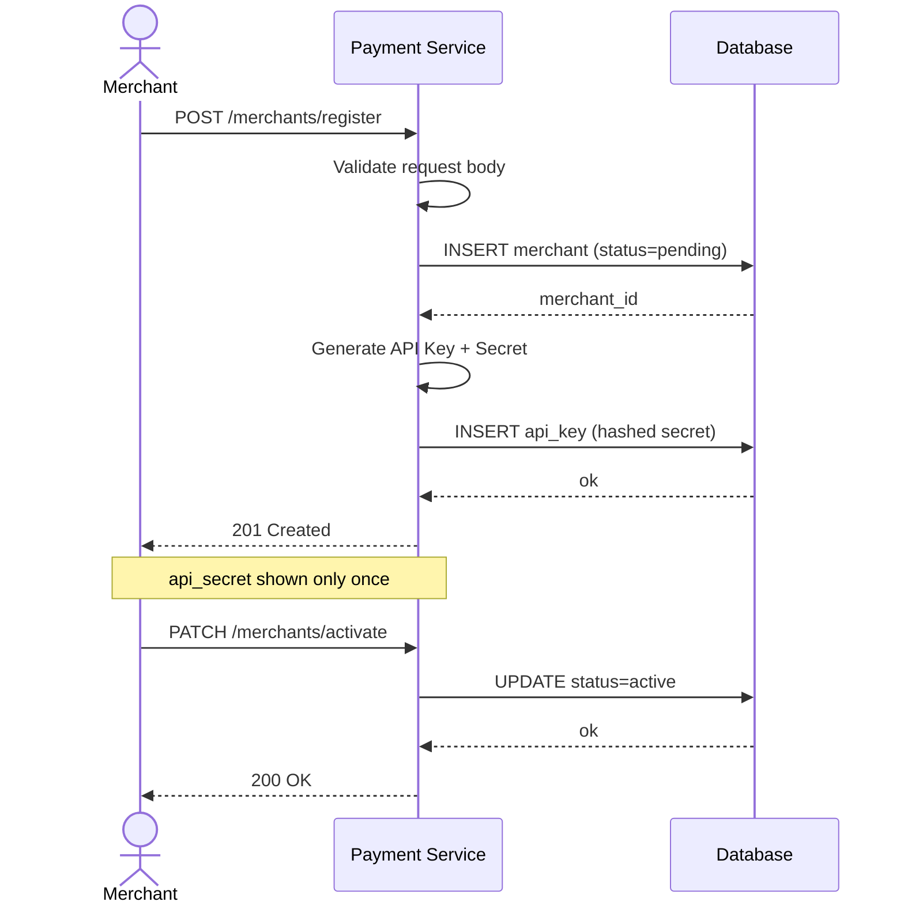
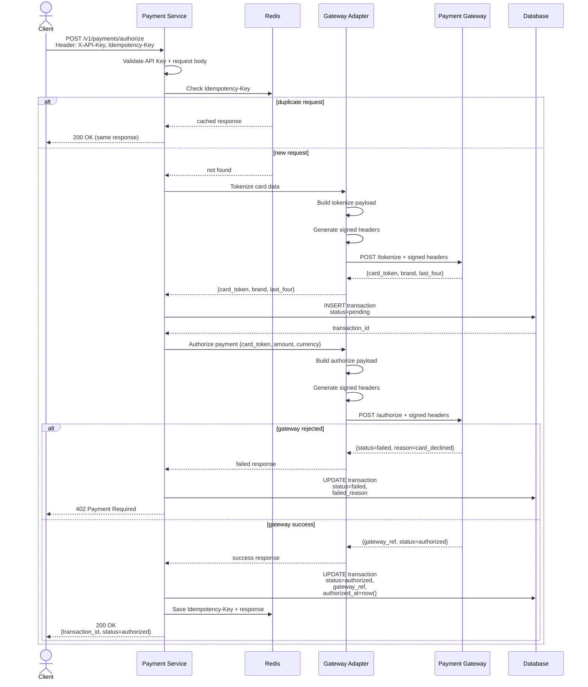
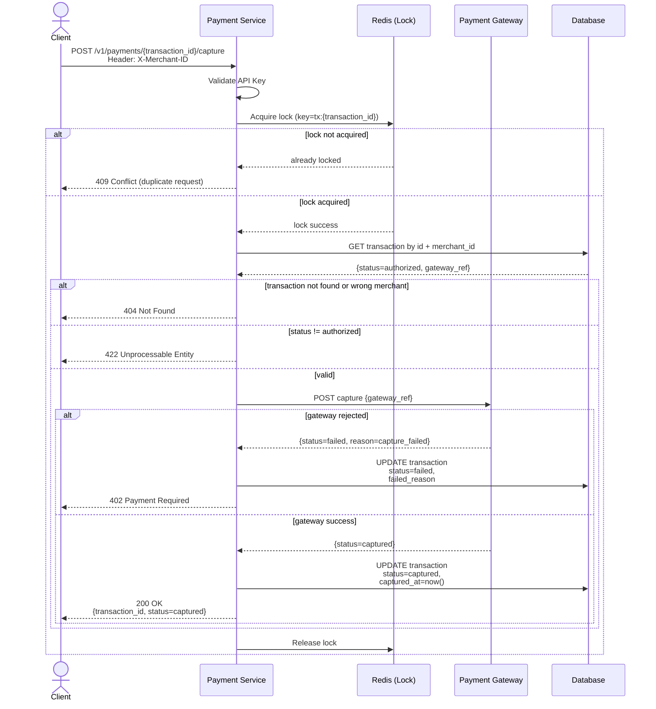
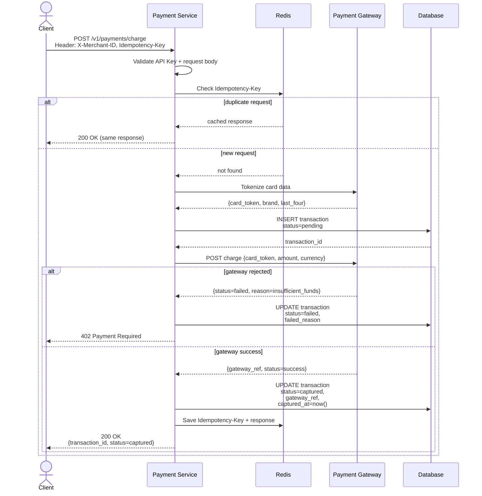
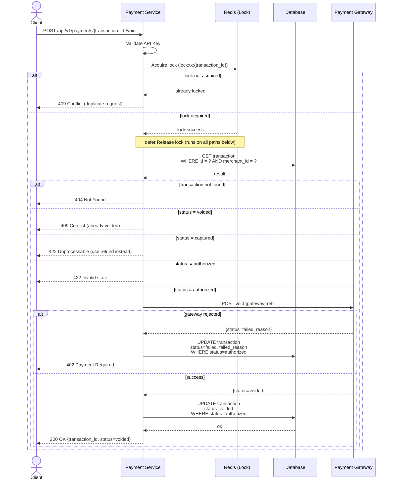
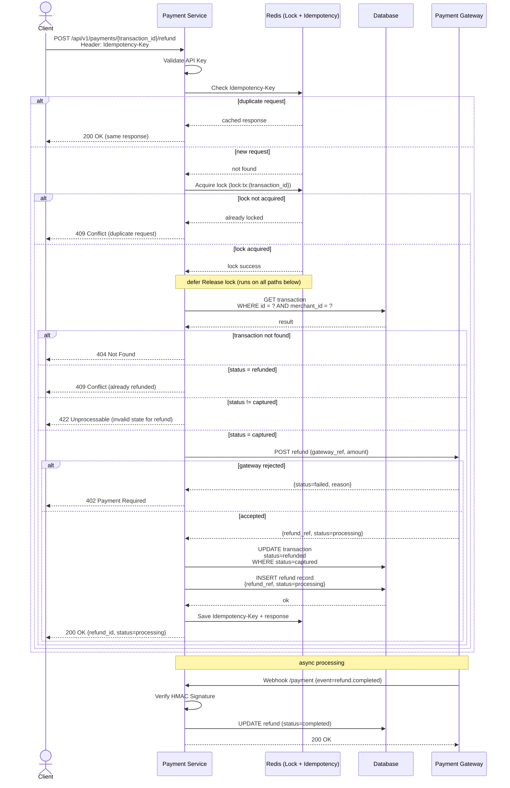
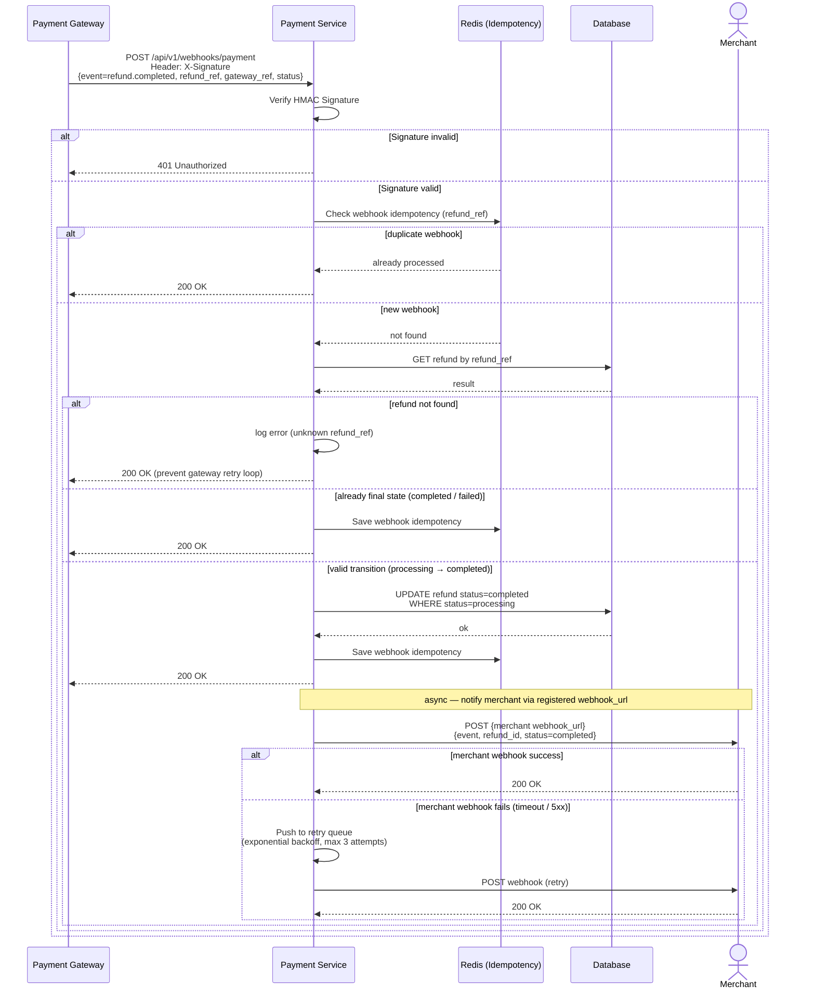

## Credit Card Payment Service

A RESTful API service for processing credit card payments through a Third-Party Payment Gateway, written in Go.

---

#### 1. Overview

The Payment Gateway API enables developers and businesses to securely integrate credit card payment processing into their applications. This service acts as a **Payment Adapter** between the merchant's system and a Third-Party Payment Gateway.

```
Merchant registers and receives API Key
        │
        ▼
Client (Web / Mobile / Backend)
        │
        ▼
Credit Card Payment Service   ◄──── Webhook / Callback
        │
        ▼
Third-Party Payment Gateway
```

---

#### 2. Features

##### 2.1 Merchant Registration & API Key Management

- Register a merchant account with business information
- Issue API Key + Secret upon successful registration
- Support Key Rotation — replace keys when compromised
- Register a Webhook URL to receive payment callbacks
- Merchant status lifecycle: `pending` → `active` → `suspended`
- Only merchants with `active` status can access the Payment API

##### 2.2 Payment Transaction

- Create a charge request with amount, currency, and order reference
- Support payment via tokenized card
- Log every request and response for auditing

##### 2.3 Card Tokenization

- Convert raw card data into a secure token before forwarding to the gateway
- Never store raw card number or CVV on the server
- Reduces PCI DSS scope for the merchant

##### 2.4 Authorize & Capture

- **Authorize** — Place a hold on funds without charging the card immediately
- **Capture** — Charge the card after a successful authorization

##### 2.5 Refund

- Full refund — return the full charged amount to the cardholder
- Query refund status at any time

##### 2.6 Void / Cancel

- Cancel a transaction that has been authorized but not yet captured
- Release the authorization hold on the cardholder's account

##### 2.7 Webhook / Callback

- Deliver real-time payment events to the merchant's registered endpoint
- Supported events: `payment.success`, `payment.failed`, `refund.completed`
- Verify HMAC Signature on every incoming webhook before processing

##### 2.8 Transaction Status

The system supports the following status lifecycle:

```
pending → authorized → captured → refunded
                    ↘
                    voided
                    ↘
                    failed
```

##### 2.9 Security

- API Key + Secret to authenticate every request
- HMAC Signature verification for webhooks
- Idempotency Key — prevents duplicate charges
- Rate limiting and request validation
- Audit log for every transaction

---

#### 3. Tech Stack

| Component | Technology              |
| --------- | ----------------------- |
| Language  | Go                      |
| Framework | Gin                     |
| Database  | PostgreSQL              |
| Cache     | Redis                   |
| Logging   | zerolog                 |
| Testing   | testify                 |
| Container | Docker / Docker Compose |

#### 4. Project Structure

```
credit-card-payment-service/
├── cmd/
│   └── server/
│       └── main.go                      # App bootstrap + infra init
│
├── internal/
│   ├── config/
│   │   └── config.go                    # Env config + DSN helper + Redis address
│   │
│   ├── infra/
│   │   ├── database/
│   │   │   └── database.go              # PostgreSQL connection
│   │   └── redis/
│   │       ├── redis.go                 # Redis connection
│   │       └── locker.go                # Distributed lock (SET NX EX)
│   │
│   ├── logger/
│   │   ├── logger.go                    # Zerolog initialization
│   │   └── middleware.go                # Gin request logging middleware
│   │
│   ├── domain/
│   │   ├── merchant.go                  # Merchant entity + status
│   │   ├── api_key.go                   # API key entity
│   │   ├── transaction.go               # Transaction entity + lifecycle
│   │   ├── refund.go                    # Refund entity + status
│   │   └── errors.go                    # Domain business errors
│   │
│   ├── handler/
│   │   ├── dto/
│   │   │   ├── merchant_dto.go          # Merchant request / response DTO
│   │   │   └── payment_dto.go           # Payment request / response DTO
│   │   ├── merchant_handler.go          # Merchant endpoints
│   │   ├── payment_handler.go           # Payment endpoints
│   │   ├── webhook_handler.go           # Webhook receiver + HMAC verify
│   │   └── playground_handler.go        # Dev-only testing UI (embed.FS)
│   │
│   ├── service/
│   │   ├── merchant_service.go          # Merchant registration, key management
│   │   └── payment_service.go           # Payment business flow
│   │
│   ├── repository/
│   │   ├── merchant_repo.go             # Merchant DB access
│   │   ├── api_key_repo.go              # API key DB access
│   │   ├── transaction_repo.go          # Transaction DB access
│   │   ├── refund_repo.go               # Refund DB access
│   │   └── idempotency_repo.go          # Idempotency key DB access
│   │
│   ├── gateway/
│   │   ├── gateway.go                   # Gateway interface + request/response types
│   │   ├── mock_gateway.go              # Mock gateway (dev + test)
│   │   └── retryable_gateway.go         # Retry wrapper (exponential backoff + jitter)
│   │
│   ├── middleware/
│   │   ├── auth.go                      # API key validation + merchant status check
│   │   ├── idempotency.go               # Duplicate request protection
│   │   └── rate_limit.go                # Rate limiter
│   │
│   ├── response/
│   │   ├── response.go                  # Success response formatter
│   │   └── error.go                     # Error response mapper
│   │
│   └── router/
│       └── router.go                    # Route registration + dependency wiring
│
├── static/                              # Embedded via embed.FS (dev only)
│   └── playground/
│       ├── index.html                   # Payment testing UI
│       ├── style.css
│       └── app.js
│
├── tools/
│   └── webhook-simulator/               # Dev tool — simulate gateway webhook callbacks
│       ├── main.go                      # HTTP server (port 8081)
│       ├── event.go                     # Events from webhook
│       ├── simulator.go                 # Event builder + HMAC signer
│       └── README.md                    # How to run + available events
│
├── migrations/
│   ├── 000001_xxxxxx.up.sql
│   └── 000001_xxxxxx.down.sql
│
├── .env.example
├── .env.local
├── .air.toml
├── docker-compose.yml
├── Makefile
└── README.md
```

> **Note:** The `/dev/playground` route is only accessible when `APP_ENV=development`. It is automatically disabled in production.

---

#### 5. API Reference

##### Base URL

```text
http://localhost:8080/v1
```

##### 5.1 Merchant Register Flow



##### 5.1.1 Register Merchant

Create a new merchant account and issue API credentials.

```http
POST /merchants/register
Content-Type: application/json
```

###### Request

```json
{
  "name": "Acme Corp",
  "email": "ops@acme.com",
  "webhook_url": "https://acme.com/webhook"
}
```

###### Success Response

**201 Created**

```json
{
  "success": true,
  "data": {
    "merchant_id": "8f7f6d4e-xxxx-xxxx-xxxx-xxxxxxxxxxxx",
    "api_key": "pk_live_xxxxxxxx",
    "api_secret": "sk_live_xxxxxxxxxxxxx",
    "status": "pending"
  }
}
```

> `api_secret` is returned **only once** and must be stored securely by the merchant.

###### Error Responses

**400 Bad Request**

```json
{
  "success": false,
  "error": "invalid request body"
}
```

**406 Not Acceptable**

```json
{
  "success": false,
  "error": "merchant already exists"
}
```

---

##### 5.1.2 Activate Merchant

Activate a merchant account that is currently in `pending` status.

```http
PATCH /merchants/activate
Content-Type: application/json
```

###### Request

```json
{
  "email": "ops@acme.com"
}
```

###### Success Response

**200 OK**

```json
{
  "success": true,
  "data": {
    "name": "Acme Corp",
    "email": "ops@acme.com",
    "status": "active"
  }
}
```

###### Error Responses

**404 Not Found**

```json
{
  "success": false,
  "error": "merchant email not found"
}
```

**406 Not Acceptable**

```json
{
  "success": false,
  "error": "merchant current status not accepted"
}
```

##### 5.2 Payment Charge Flow

The payment service supports two transaction modes to cover real-world payment scenarios:
• Authorize + Capture (2-step payment)
Used when the merchant wants to hold the cardholder’s funds first (`pending → authorized`) and capture (`authorized → captured`) the payment later after confirming the order, inventory, or service.
• Direct Charge (1-step payment)
Used when the merchant wants to charge (`pending → captured`) the card immediately without placing a hold.

The following sections describe the Authorize → Capture flow, which is commonly used in booking systems, hotel reservations, and order confirmation processes.

##### 5.2.1 Authorize (Hold)

This flow places a temporary hold on the customer’s available balance without immediately transferring funds.



##### 5.2.2 Capture

This flow completes the actual payment after a successful authorization by transferring the held amount.



##### 5.2.3 Capture Directly

This flow charges the customer immediately without placing a temporary hold.



##### 5.3 Void / Cancel Flow

Cancels an `authorized` transaction before capture.

The service acquires a Redis lock to prevent duplicate requests, then validates that the transaction is in authorized state. If valid, it calls the gateway to void the payment and updates the transaction status accordingly (voided or failed). Finally, the lock is released and the result is returned.



##### 5.4 Refund Flow

Refunds a `captured` transaction asynchronously.

The service validates the request and uses idempotency + Redis lock to prevent duplicate refunds. It then calls the gateway to initiate the refund and stores a refund record with processing status. The final result is updated later via webhook from the gateway.



##### 5.5 Webhook / Callback Flow

Handles asynchronous updates from the payment gateway (e.g. refund completion).

The service verifies the HMAC signature to ensure the request is trusted, then checks idempotency to avoid processing duplicate events. It updates the corresponding record (e.g. refund status) in the database and returns a success response. After that, the event is forwarded to the merchant’s webhook endpoint with retry on failure.


