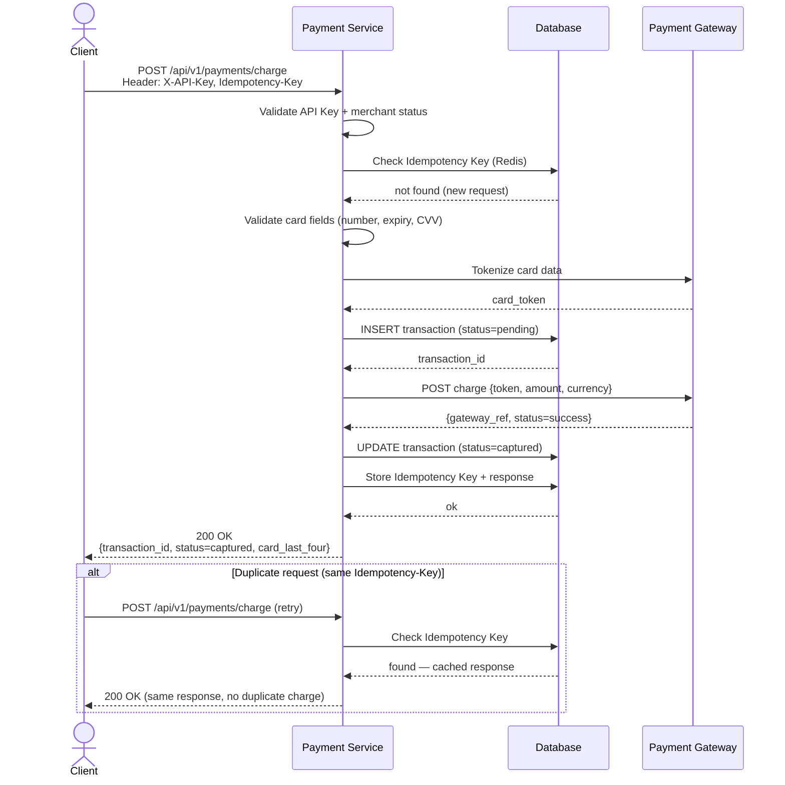
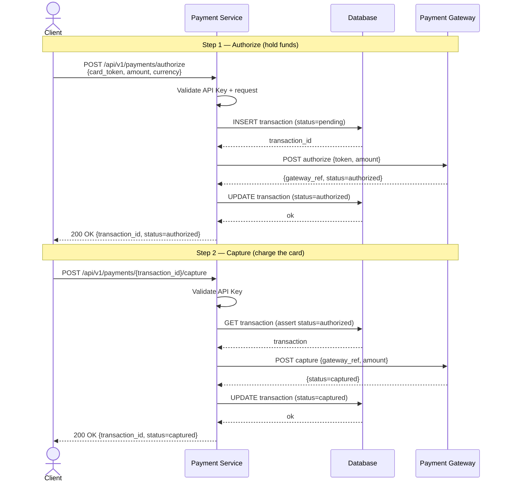
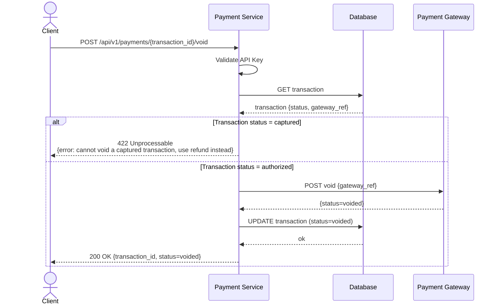
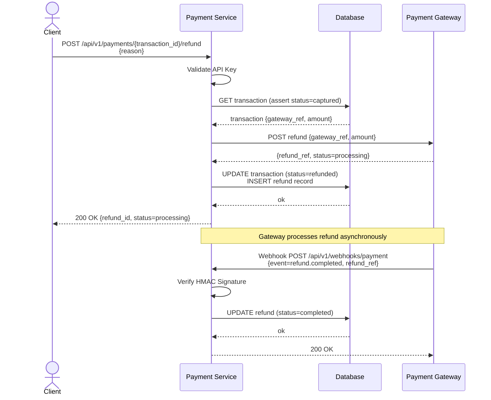
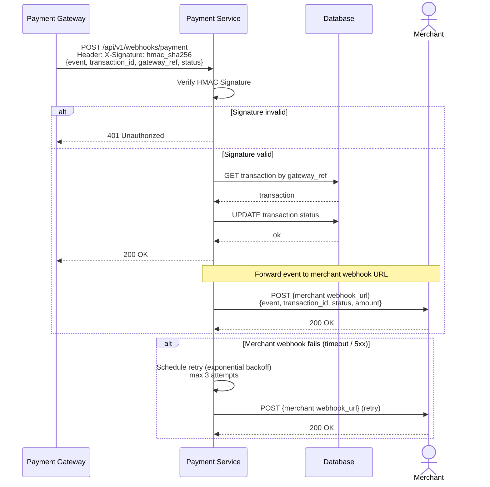

## Credit Card Payment Service

A RESTful API service for processing credit card payments through a Third-Party Payment Gateway, written in Go.

---

#### 1. Overview

The Payment Gateway API enables developers and businesses to securely integrate credit card payment processing into their applications. This service acts as a **Payment Adapter** between the merchant's system and a Third-Party Payment Gateway.

```
Merchant registers and receives API Key
        │
        ▼
Client (Web / Mobile / Backend)
        │
        ▼
Credit Card Payment Service   ◄──── Webhook / Callback
        │
        ▼
Third-Party Payment Gateway
```

---

#### 2. Features

##### 2.1 Merchant Registration & API Key Management

- Register a merchant account with business information
- Issue API Key + Secret upon successful registration
- Support Key Rotation — replace keys when compromised
- Register a Webhook URL to receive payment callbacks
- Merchant status lifecycle: `pending` → `active` → `suspended`
- Only merchants with `active` status can access the Payment API

##### 2.2 Payment Transaction

- Create a charge request with amount, currency, and order reference
- Support payment via tokenized card
- Log every request and response for auditing

##### 2.3 Card Tokenization

- Convert raw card data into a secure token before forwarding to the gateway
- Never store raw card number or CVV on the server
- Reduces PCI DSS scope for the merchant

##### 2.4 Authorize & Capture

- **Authorize** — Place a hold on funds without charging the card immediately
- **Capture** — Charge the card after a successful authorization

##### 2.5 Refund

- Full refund — return the full charged amount to the cardholder
- Query refund status at any time

##### 2.6 Void / Cancel

- Cancel a transaction that has been authorized but not yet captured
- Release the authorization hold on the cardholder's account

##### 2.7 Webhook / Callback

- Deliver real-time payment events to the merchant's registered endpoint
- Supported events: `payment.success`, `payment.failed`, `refund.completed`
- Verify HMAC Signature on every incoming webhook before processing

##### 2.8 Transaction Status

The system supports the following status lifecycle:

```
pending → authorized → captured → refunded
                    ↘
                    voided
                    ↘
                    failed
```

##### 2.9 Security

- API Key + Secret to authenticate every request
- HMAC Signature verification for webhooks
- Idempotency Key — prevents duplicate charges
- Rate limiting and request validation
- Audit log for every transaction

---

#### 3. Tech Stack

| Component | Technology              |
| --------- | ----------------------- |
| Language  | Go                      |
| Framework | Gin                     |
| Database  | PostgreSQL              |
| Cache     | Redis                   |
| Logging   | zerolog                 |
| Testing   | testify                 |
| Container | Docker / Docker Compose |

#### 4. Project Structure

```
credit-card-payment-service/
├── cmd/
│   └── server/
│       └── main.go                  # Entry point
│
├── internal/
│   ├── config/
│   │   └── config.go                # App config (env binding)
│   │
│   ├── domain/
│   │   ├── merchant.go              # Merchant entity, status, API key
│   │   ├── payment.go               # Payment entity, value objects, status
│   │   └── errors.go                # Domain errors
│   │
│   ├── handler/
│   │   ├── merchant_handler.go      # Register, get key, rotate key
│   │   ├── payment_handler.go       # HTTP handlers (charge, capture, refund, void)
│   │   ├── webhook_handler.go       # Webhook receiver + HMAC verify
│   │   └── playground_handler.go    # Serve embedded HTML playground (dev only)
│   │
│   ├── service/
│   │   ├── merchant_service.go      # Merchant registration, key management
│   │   ├── payment_service.go       # Business logic
│   │   └── token_service.go         # Card tokenization logic
│   │
│   ├── repository/
│   │   ├── merchant_repo.go         # Merchant DB access
│   │   ├── payment_repo.go          # Transaction DB access
│   │   └── token_repo.go            # Token DB access
│   │
│   ├── gateway/
│   │   └── gateway_client.go        # Third-party gateway adapter
│   │
│   └── middleware/
│       ├── auth.go                  # API Key validation + merchant status check
│       ├── idempotency.go           # Idempotency key check (Redis)
│       └── rate_limit.go            # Rate limiter
│
├── static/                          # Embedded via embed.FS (dev only)
│   └── playground/
│       ├── index.html               # Main playground UI
│       ├── style.css                # Styles
│       └── app.js                   # Call API, render response
│
├── migrations/
│   ├── 000001_create_merchants.up.sql
│   ├── 000001_create_merchants.down.sql
│   ├── 000002_create_transactions.up.sql
│   ├── 000002_create_transactions.down.sql
│   ├── 000003_create_tokens.up.sql
│   └── 000003_create_tokens.down.sql
│
├── .env.example
├── docker-compose.yml
├── Makefile
└── README.md
```

---

#### 5. Sequence Diagram Flow

##### Merchant Registration Flow

```mermaid
sequenceDiagram
    actor M as Merchant
    participant S as Payment Service
    participant DB as Database

    M->>S: POST /merchants/register
    S->>S: Validate request body
    S->>DB: INSERT merchant (status=pending)
    DB-->>S: merchant_id

    S->>S: Generate API Key + Secret
    S->>DB: INSERT api_key (hashed secret)
    DB-->>S: ok

    S-->>M: 201 Created
    Note over M,S: api_secret shown only once

    M->>S: PATCH /merchants/activate
    S->>DB: UPDATE status=active
    DB-->>S: ok
    S-->>M: 200 OK
```



##### Payment Charge Flow



##### Authorize & Capture Flow



##### Void / Cancel Flow



##### Refund Flow



##### Webhook / Callback Flow



The system is designed to integrate with any Web, Mobile, or Backend service and supports the full transaction lifecycle — from creating a payment intent through to refund and void. **Only registered merchants with an active API Key are permitted to access the Payment API.**

---

> **Note:** The `/dev/playground` route is only accessible when `APP_ENV=development`. It is automatically disabled in production.
